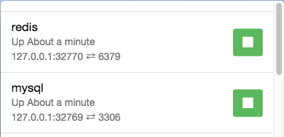

docker-indicator
----------------

Shows an icon in the menu bar with the status of docker and a simple menu to start/stop containers.

**Why?**

I often forget if docker is running and this gives a quick visual.

## Status

Running (can make a connection)


Not running (or at least cannot connect to one)


*It can take a few seconds to update the status if connecting to a docker machine instance*

Started container list (shows on top)



Stopped container list


## Usage

A `dmg` is provided in the `releases`.
Otherwise, in the source directory start with `npm start`.

## Connection
In version `0.1.0` a `.docker-indicator.yaml` file in your home directory is **optional**. If no file is found, the default socket at `/var/run/docker.sock` is used.

If connecting to a docker machine instance not available via a socket.
```
docker:
    protocol: https
    ip: 192.168.99.100
    port: 2376
    ca: /Users/user/.docker/machine/machines/default/ca.pem
    cert: /Users/user/.docker/machine/machines/default/cert.pem
    key: /Users/user/.docker/machine/machines/default/key.pem
```

### Icon
[Whale by Aditya Dipankar from the Noun Project](https://thenounproject.com/search/?q=whale&i=194454)

## Changelog


0.2.1
* Fix socket location with Docker 1.11.1

0.2.0
* Show better network address

0.1.0
* Use socket by default
* Update dependencies (electron 0.36.12 amoungst others)

**0.0.4**
* Bug fixes for UI updates
* OS X build

**0.0.3**
* New icons
* UI updates appropriately

**0.0.2**
* Try to connect to docker smartly

**0.0.1**
* UI reacts to Docker events
* Start/Stop buttons work on containers

